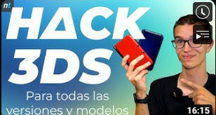

# 👀 Hack

### Requisitos

* Consola Virgen 3ds/2ds de cualquier modelo en versiones 11.17
* Tarjeta Sd/Micro Sd en formato FAT32 de 4 a 32 GB
* 8GB: [https://amzn.to/3yx0ViF](https://amzn.to/3yx0ViF)
* 16GB: [https://amzn.to/3fXnTcg](https://amzn.to/3fXnTcg)
* 32GB: [https://amzn.to/3rHmbOS](https://amzn.to/3rHmbOS)
* Archivos Hack :
* Acortados (Apoyas al proyecto) [https://link-hub.net/1024337/ugs-3ds-mset-9](https://link-hub.net/1024337/ugs-3ds-mset-9)
* Sin acortador Abajo del todo.

**PASO 1. RESPALDO NINTENDO 3DS Y CREACIÓN MII**

* Introducir la SD en el ordenador y respaldar la carpeta Nintendo 3Ds en el escritor.
* Dejar la SD vacía e introducirla en la consola.
* Esperar a que se cree la nueva información.
* Acudir a la aplicación Mii y, tras cargar, salir al Home.
* Ir a Configuración de la consola y sacar la SD.
* Meter la Sd en el ordenador **sin apagar la consola**.

**PASO 2. DESCARGAR ARCHIVOS HACK**

* Introducir todos los archivos de la carpeta SD en la Tarjeta SD de la Consola
* Introducir la carpeta dbs en la ruta: Nintendo 3Ds/carpeta dígitos1/carpeta dígitos2
* Introducir la Sd en la consola.
* Volver a la consola: Configuración - Gestión de datos - Nintendo 3Ds - Programas. Borrar.
* En Configuración, acudir a Datos Adicionales. Saldrá el Mii.
* **Quitar la SD sin tocar ningún botón ni bajar la tapa ni apagar la consola**.
* Meter la Sd en el ordenador.

**PASO 3. FIXEAR MII Y EJECUTAR EXPLOIT**

* instalaremos Python (viene en los link de descargas)
* Ejecutaremos, dentro de la Sd, el programa mset9.
* Elegiremos el modelo de consola y la versión.
* Elegiremos la opción 1 (instalar mset9) y la opción 2 para inyectarlo.
* Introduciremos la Sd en la consola, la cual la habíamos dejado encendida en el panel Datos Adicionales.
* La consola expliteará y estaremos en el Godmode9.

**PASO 4. INSTALAR SCRIPTS**

Dentro del Godmode9:

* Pulsaremos el botón Home
* Acuderemos a la opción MORE, y después Scripts...
* Ejecutaremos el Script PASO 1 Methax Retro (al finalizar la consola se reiniciará de nuevo al Godmode9)
* Tras el reinicio, si nos pregunta si deseamos configurar una "Hora predeterminada" pulsaremos \[B]
* Una vez dentro, pulsaremos el botón Home
* Acudiremos a la opción Scripts...
* Ejecutaremos el scripts PASO 2 ACT3DS
* Terminado el proceso, la consola reiniciará Si saliera el panel de Luma, se debe verificar tener la 3ª opción marcada (Mostrar Nand o texto...) y el Splash de seguridad en Antes o Después. Darle al botón Start para salir del menú y reiniciar.
* Meter la Sd en el ordenador.

**PASO 5. LIMPIEZA Y RECUPERACIÓN**

(si no se creo un respaldo, no es necesario eliminar la carpeta Nintendo 3ds) **Ya tendremos la consola modificada y con el FBI inyectado**

* De nuevo en la SD, ejecutaremos el programa mset9.
* Elegiremos la opción 3 (desfixear mii) y la opción 4 (desinstalar mset9)
* Eliminaremos todos los archivos menos las carpetas gm9, luma y los archivos boot.firm y boot.3dsx
* Meteremos el respaldo de la carpeta Nintendo 3ds que habíamos creado en el Paso 1.

(si no se creo un respaldo, no es necesario eliminar la carpeta Nintendo 3ds)

&#x20;**Ya tendremos la consola modificada y con el FBI inyectado**

Para Finalizar, tras cualquier proceso de hackeo se debe realizar el **Respaldo de creación de la NAND:** [**https://www.youtube.com/watch?v=3kaKZRm0nAw\&t=119s**](https://www.youtube.com/watch?v=3kaKZRm0nAw\&t=119s)**.**

### Tutorial en vídeo

[https://youtu.be/HtLHVzBqtds?si=SQEoINfNP5FB6x9o](https://youtu.be/HtLHVzBqtds?si=SQEoINfNP5FB6x9o)

<figure><figcaption></figcaption></figure>

Fuente: LA PRESA [https://discord.gg/Tst2mvCjpm](https://discord.gg/Tst2mvCjpm)

Agradecimientos: Kelonio 3ds, Nintriks\

Enlace sin acortador: [https://mega.nz/folder/CqZzzTob#2\_c4g0DTTSeFA5XDZs2wHw](https://mega.nz/folder/CqZzzTob#2\_c4g0DTTSeFA5XDZs2wHw)

\

\
