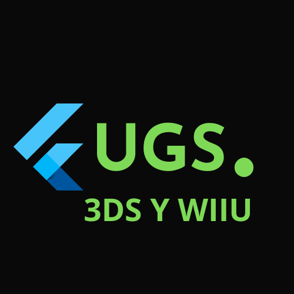

# 👉 Presentación

### UGS Es una guía 100% en español y para hispanohablantes que permite la liberación de algunas consolas de Nintendo.

<figure><figcaption>
Logo de UGS 4 WIIU y 3ds
</figcaption></figure>

#### Información a aclarar.

1. Esto es una guía de Scene, nunca será promocionada la piratería de ningún tipo y se respeta completamente los derechos protegidos.
2. Esta guía es una alternativa a otras guías como haks.guide pero en español y orientada a usuarios algo experimentados.
3. Esta guía no es la mas actualizada que vas a encontrar, datos como versiones, CFW, etc pueden no estar a la orden del Día.
4. No se ofrece soporte técnico (Por ahora) pero se recomendarán sitios (externos a esta guía) donde pueden dejar sus preguntas.
5. Esta guía se basa en mi experiencia y por eso solo entran los sistemas de 3DS Y WIIU
6. Se agradecen cualquier tipo de donación o ayuda, puedes apoyar visitando la página [DONACIONES Y AYUDA](inicio/donaciones-y-creditos.md) .
7. Por favor si hay alguna información que no es correcta [contáctame](https://survey.forms.app/tristanabs/contact-form).
8. Para apoyar el proyecto algunos enlaces estarán acortados por [https://linkvertise.com/](https://linkvertise.com/). (Puedes elegir si aportar o no)

### Avances del proyecto

* [x] Presentación
* [x] Donaciones y Créditos
* [x] Inicio (3DS)
* [x] Hack (3DS)
* [x] Archivos MSET9
